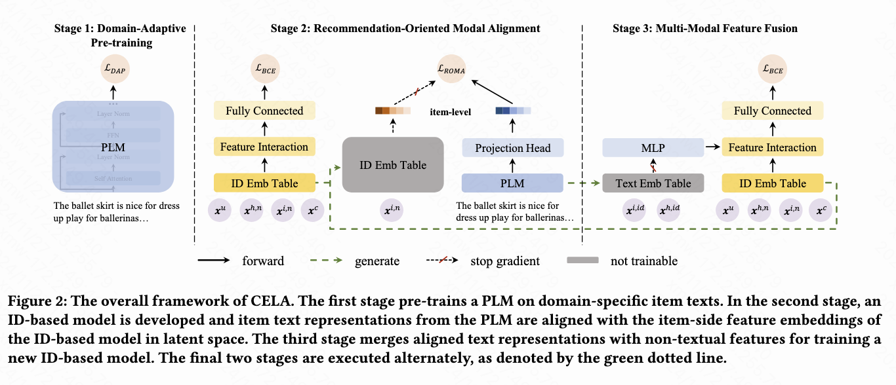

# CELA: Cost-Efficient Language Model Alignment for CTR
Language models have demonstrated remarkable versatility across various fields, with their extensive knowledge and reasoning capabilities showing promise for enhancing recommendation tasks. Researchers have found that fine-tuning language models for downstream tasks can further boost their effectiveness; however, applying this to large-scale recommendation data is often prohibitively time-consuming due to the volume of user-item interactions and the complexity of language models.
Therefore, this repo aims to provide an efficient fine-tuning method to quickly enhance the PLM's compatibility with recommendation data while leveraging texts to improve CTR prediction performance. 

For more details, please refer to [our paper](https://arxiv.org/abs/2405.10596).

<div align=center></div>

## Usage

Clone this repo and set `DATA_MOUNT_DIR=[DOWNLOAD_PATH]/data` in your environment.

### Data preprocess
Download Amazon Sports dataset from [here](https://cseweb.ucsd.edu/∼jmcauley/datasets/amazon_v2/) and then process data:
```bash
python build_dataset.py amazon-sports
```

### Training
**ID-Based Model**
```bash
python run_ctr.py amazon-sports
```

**Pre-training LM**
set `model_name_or_path` in `config/mlm.yaml` and then
```bash
python script/run_mlm.py amazon-sports
```

**Fine-tuning LM**
set `ctr_model/pretrained_dir` in `config/align.yaml` and then
```bash
python script/run_align.py amazon-sports [PRE_TRAINED_LM_PATH]
```

**Training recommendation backbone**
```bash
python script/run_cotrain.py amazon-sports [OUPUT_PATH] [FT_LM_PATH] [TOKENIZER_PATH]
```

## Citation
If you find this project useful in your research, please cite our research paper:
```
@article{wang2024cela,
  title={CELA: Cost-Efficient Language Model Alignment for CTR Prediction},
  author={Wang, Xingmei and Liu, Weiwen and Chen, Xiaolong and Liu, Qi and Huang, Xu and Lian, Defu and Li, Xiangyang and Wang, Yasheng and Dong, Zhenhua and Tang, Ruiming},
  journal={arXiv preprint arXiv:2405.10596},
  year={2024}
}
```
